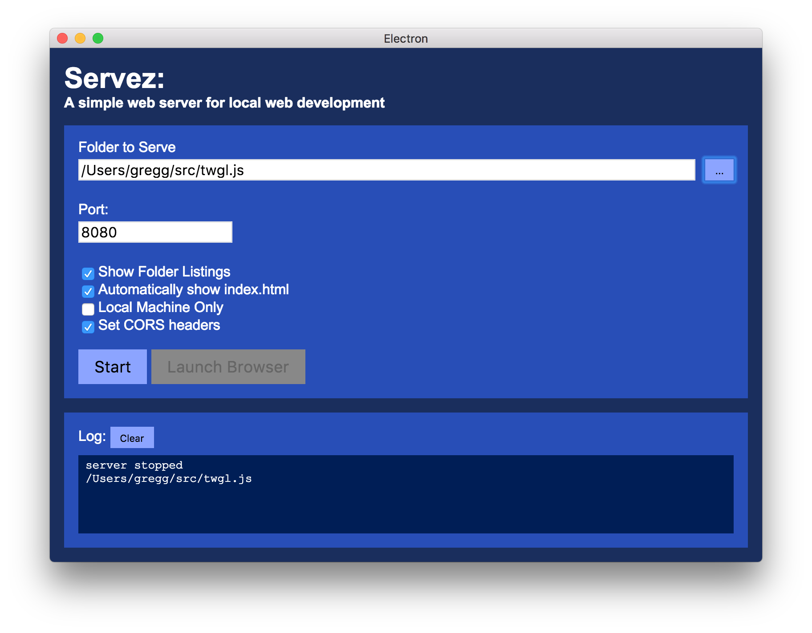

# Servez

A simple web server for local web development.

## What?

Servez is an stand alone app that runs a simple web server.
with a GUI to start/stop and choose a folder to serve.

I've worked with many people, often students, who are not
comfortable with command lines and certainly not comfortable
setting up a big server like Apache.

Servez provides them with an easy way to get started without
having to install multiple dependencies nor having to integrate
things with their system. No adding to paths, no downloading
3 different pieces of software. Just run and start.

